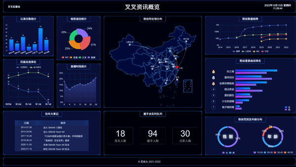

这是一个基于 React / ECharts 的大屏可视化项目，部分数据为虚构。

[预览地址](https://yilunyuwan.gitee.io/big-screen/#/)   [源码链接](https://gitee.com/yilunyuwan/big-screen) [项目笔记](https://www.yuque.com/yilunyuwan/big-screen/intro)

- 使用 Grid 和 Flex 布局及动态 rem 方案，页面可适配各尺寸大屏。

- 实现了柱形图、折线图、饼图、地图等图例，支持实时更新数据。

- 为个别图例添加动画特效，提高了页面的美观度。

- 名次样式使用富文本标签，增强了数据的可读性。